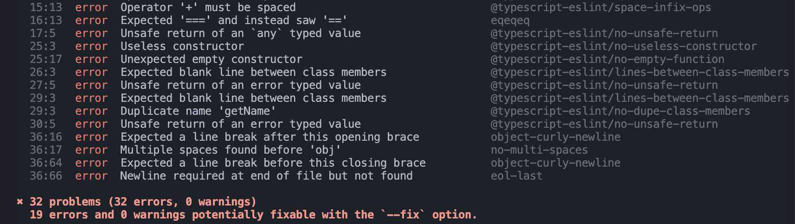

<div>
  
 
</div>

## Coding Standards
Coding standards are a set of rules or style guidelines that programmers follow when writing code in a certain language. I think holding ourselves to these coding standards can be beneficial for learning any new programming language. Coding standards have a huge impact on code readability. Especially when working in a team, it is important to write code that is easy for others to understand and contribute to. Following coding standards can also ultimately prevent errors. For example, if you define an optional property of a type and try to call or use it while it is undefined, this could lead to a runtime error! Thankfully, there are many tools we could use to enforce these coding standards, such as Checkstyle for Java. One great tool I have started using is ESLint for Typescript.
<br> 

## ESLint for Prettier Code
ESLint is an extension for Visual Studio Code which identifies issues that affect code quality and style for Javascript and Typescript. In ICS 314, we have recently practiced using ESLint for Typescript programs with the AirBnb style guide. After just one week of using ESLint for writing in Typescipt, it has proven to be useful and easy to use. I do not mind fixing the issues that ESLint detects because it makes my code readable and ensures that the style stays consistent.
<br>

There is also the option to have ESLint fix your code using the ```npm run lint -- --fix``` command in the terminal which makes achieving the coding standards much easier. Even though I have mostly been fixing the ESLint errors manually to familiarize myself with the Typescript coding style, the command will definitely come in handy later on. Below is an example of what pops up in my terminal if some of my Typescript code does not follow the coding standards:

<div>
  
 
</div>
<br>
I think it's important that, as programmers, we make use of these tools to make coding more efficient and enjoyable rather than stressful and we develop the habit of following coding standards.