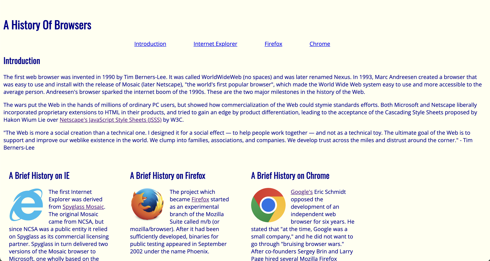

<div>
  
 
</div>

User Interface (UI) frameworks serve as helpful tools for styling websites. Bootstrap is a popular UI framework that provides pre-designed templates and elements for web pages such as: buttons, icons, headers, and footers. It can be set up easily on a Visual Studio Code workspace through a content delivery network (CDN) by pasting the required links at the top of an HTML file that needs to be styled. Including Bootstrap from a CDN also allows the website to load faster for users!
<br> 

## My thoughts on Bootstrap 5
I find Bootstrap to be more convenient than just using HTML and CSS alone. Using the shorthand classes within HTML is much easier than making a seperate class on css for each element or group of elements. For instance, to center an element in HTML with the help of Bootstrap, we can define the class for a division in HTML with ```div class="mx-auto"``` is easier than creating a class for that object and adjusting the left and right margins with ```margin-left: auto; margin-right: auto;```. 
<br> 

However, learning Bootstrap wasn't all too easy. At first, I was confused on how to customize the default colors, fonts, and styling that Bootstrap includes with it's elements. However, I was able to figure out how to do so, for example, to change the default navigation bar's color from one of their default colors:```<nav class="navbar navbar-expand-sm navbar-dark fixed-top bg-dark">``` we can just add: ```style="background-color: #1b4f24;"``` to change the default bg-dark color to any color we like. After practicing styling with Bootstrap by recreating webpages, I can now confidently create basic website components such as navigation bars.
<br> 

Overall, I think learning Bootstrap was fun, although it took some practice to get the hang of, it turned out to be easy and convenient to use. I would like to learn to style web pages with other UI frameworks too. 
<br> 

## Just CSS vs. UI Framework
On the left is an image of a webpage I created for ICS 314 without Bootstrap and on the right is the same webpage created with Bootstrap. The webpage on the right, with the navigation bar at the very top, looks neat and professional. Although I would still be able to create the same effects without Bootstrap, it would require more code. Bootstrap makes styling much less messy and complex.
<br>
<div style="display: flex; gap: 10px;">


</div>
