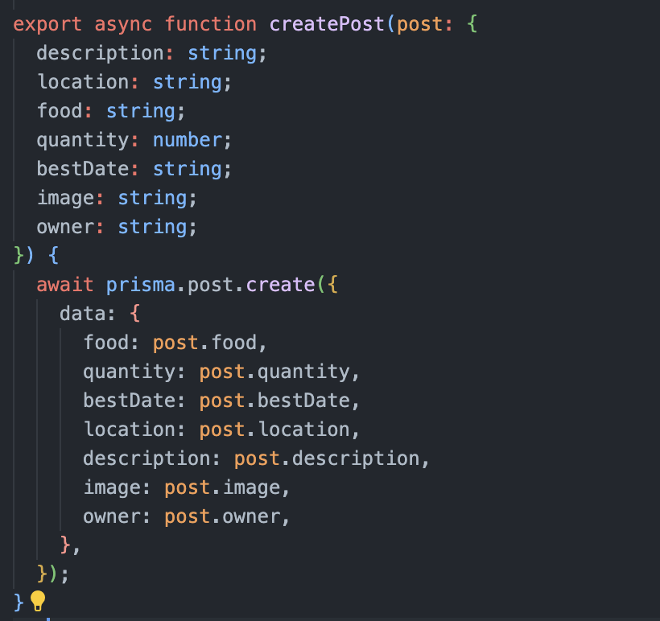

## Programming is Like Building Legos

Instead of developing software from scratch with every project, programmers and developers can use design patterns, solutions to common coding problems. Design patterns provide blueprints or processes that can be modified to fit a project’s specifications. Design patterns are like LEGO blueprints or more so the Lego builder app. Just like Lego builders use creativity and instructions to create flexible and aesthetic models, developers use design patterns to structure their applications in smart and efficient ways. These blueprints help turn a pile of blocks into something functional, strong, and or pretty. The great thing about Lego is that the same pieces can be used to make different sets.
 

## Design Patterns Used For My Final Project

In my ongoing team final project for ICS 314: Software Engineering I built with Next.js, TypeScript, CSS, and React Bootstrap, I found myself using “LEGO techniques” to make sure the website, Campus Plate Mate, was functional and programming was efficient.
 

## Factory Pattern
For the final project, I was in charge of making the “Post A Bite” page functional, being able to write to the database. For this specific issue, the factory pattern was most useful as it encapsulates the logic needed to create standardized objects. Whenever a post is created and shared, it always follows the same structure and each post has the same required fields of information. Imagine building a Lego minifigure, most of them have the same parts: head, hair, torso, legs, and accessories. The following function for creating a post in Typescript is shown in the following picture. All posts follow the same structure, just like minifigures do!
 

## Model-View-Controller Pattern
I also used the Model-View-Controller (MVC) Pattern to keep things structured. With the Post model in our schema.prisma file we define what a post should look like, including types and requirements. The ‘view’ part is built using React and styled with CSS and Bootstrap, creating a clean and responsive user interface. The API routes act like the controller, taking input from forms, interacting with the database, and allowing users to view information from the database. This reminded me of LEGO blueprints, which break builds into logical stages: first the foundation, walls, doors, windows, then the fun decor and minifigures. This structure made the website development easier to understand for myself and the rest of my team members.
 

This essay was written with the help of AI (ChatGPT).
