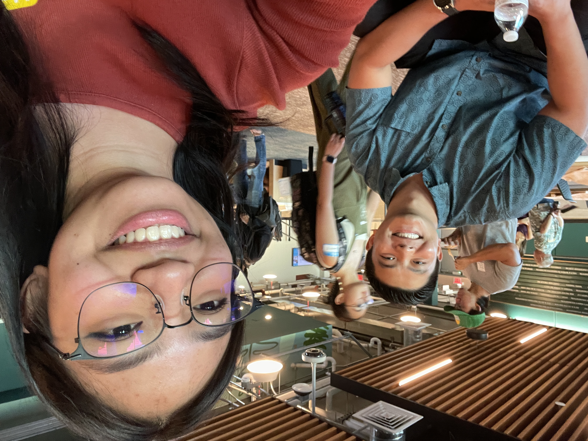

## Networking at the Tech Minds Meetup

The Tech Minds Meetup hosted by the Pacific Asian Center for Entrepeneurship (PACE) allowed students like me interested in the tech and or business industry to network with tech professionals and entrepenuers. I networked with multiple software engineers and UH alumni who were able to give me and other students advice on pursuing careers in tech.

 

I had the opportunity to network with Brody Uehara, a software engineer at KwH Analytics, a climate insurance provider, who kindly took a picture with me. I asked them about whether AI is used often in their workplace and was told that it was. No matter the goal or focus, AI seems to be a valuable and widely used tool in the tech industry. I also learned that many of the hands-on skills that they have acquired, and the skills we will need as students pursuing careers in tech, will be taught through internships, work, and projects. Thus, I was advised to pursue internship opportunities and work on projects that interested me the most.

I also networked with Kristian Lazo, a software engineer for VolunteerAlly, a local organization that helps connect people to volunteering opportunities, organizations, and events in Hawai'i. The interns for VolunteerAlly are currently working on front-end development and learning back-end development for the platform as well. Something that I thought was really interesting and inspiring was that VolunteerAlly originally started out as an ICS 314 final project! Their project eventually became an organization currently making an impact on our community.  

## What I learned

Overall, the meetup was a very valuable experience providing me with a lot of insights into the tech industry and the workplace. I was really impressed by the stories and thankful for the advice that the professionals were able to share with me. Most importantly, I learned that taking opportunities as they come and making connections are going to be helpful for us to start out in the tech industry or in any career path in the future. I will keep this in mind throughout my academic journey in hopes of developing my skills and gaining experience.