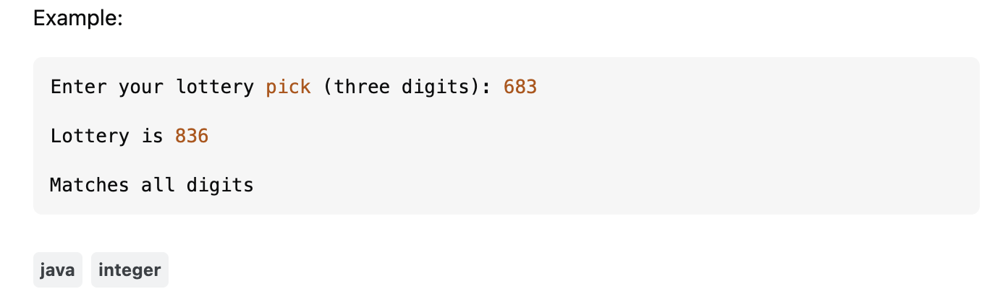
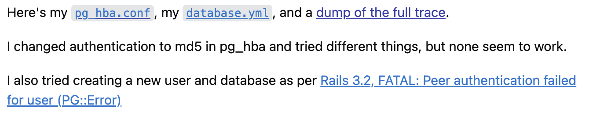

  
 

To differentiate between smart and not-so-smart questions we can use [How To Ask Questions The Smart Way](http://www.catb.org/esr/faqs/smart-questions.html) by Eric Steven Raymond as a guide. 

## A Not-So-Smart Question 

An example of a [not-so-smart question](https://stackoverflow.com/questions/79359826/how-do-you-get-numbers-to-match-even-if-they-are-not-in-the-correct-order) is one that is currently closed on Stack Overflow because of its lack of clarity. The question itself, “How do you get numbers to match even if they are not in the correct order?” can be quite confusing to users at first glance because it is not specific nor does it specify any details. What does the user mean by getting numbers to match? What “order” is the user referring to? The goal is not clear in this question, therefore, according to Raymond’s principles, this question is not-so-smart.

Additionally, although the language, Java, is tagged, the user does not mention it in the question or throughout the description. The question also does not include any code whatsoever, just the output, which forces others to ask follow-up questions instead of providing direct answers. When asking about code, it is important that we include any attempts or a minimal test case. One respondent mentioned that it is not clear whether the person used actual integers in their code. Comments like these are signs that the question being asked is not a smart one.

 

 

## What is a Smart Question?

On the other hand, [this question](https://stackoverflow.com/questions/18664074/getting-error-peer-authentication-failed-for-user-postgres-when-trying-to-ge) on Stack Overflow is clear and meaningful, following Raymond’s guidelines for smart questions. Immediately, the question: “Getting error: Peer authentication failed for user "postgres", when trying to get pgsql working with rails” provides others with sufficient information to grasp what the user is trying to achieve or the problem they need to solve. First of all, the user provides a specific error. The user also provides the software being used, PostGreSQL, and the framework, Ruby on Rails. 

The necessary logs and files provided are nicely linked all in one line and not carelessly pasted into the post. The post is easy to navigate, allowing respondents to quickly locate any errors in the files. The user briefly stated ways they tried to fix their error, which exhibits the user's problem solving skills and ensures that respondents do not suggest something that was already attempted. In response, the user received direct, detailed solutions with useful tips and linked references.

 

 
