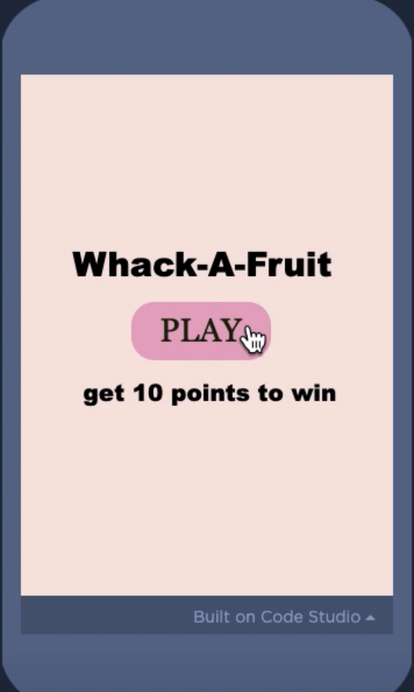
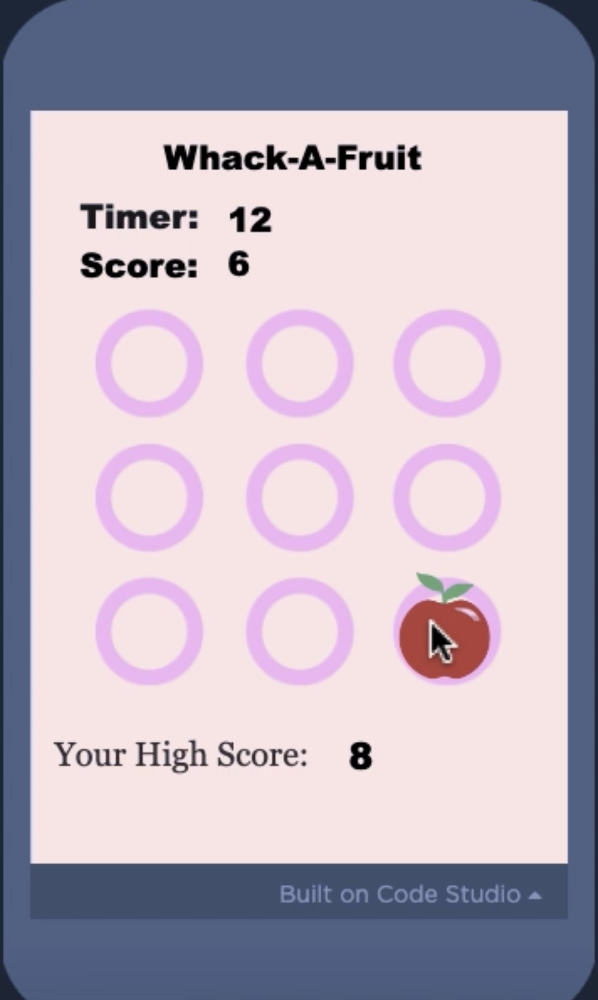
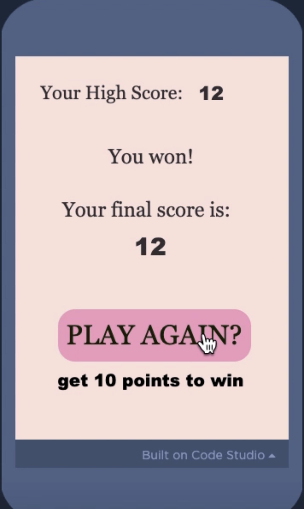

 
Whack-a-Fruit is a simple game, designed and developed entirely by myself. The game displays an apple appearing in random places on the screen. The player must "whack" the apple 10 times in the span of 20 seconds in order to win. This game allows players to test their reflex skills.

 

This project tested my understanding of Javascript and introduced me to the design and implementation process of game/web development. It helped me develop my problem-solving, user interface design, and creative thinking skills.
