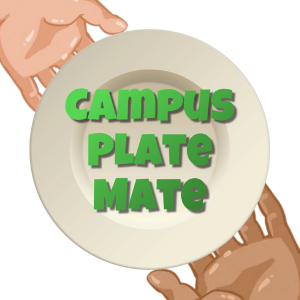
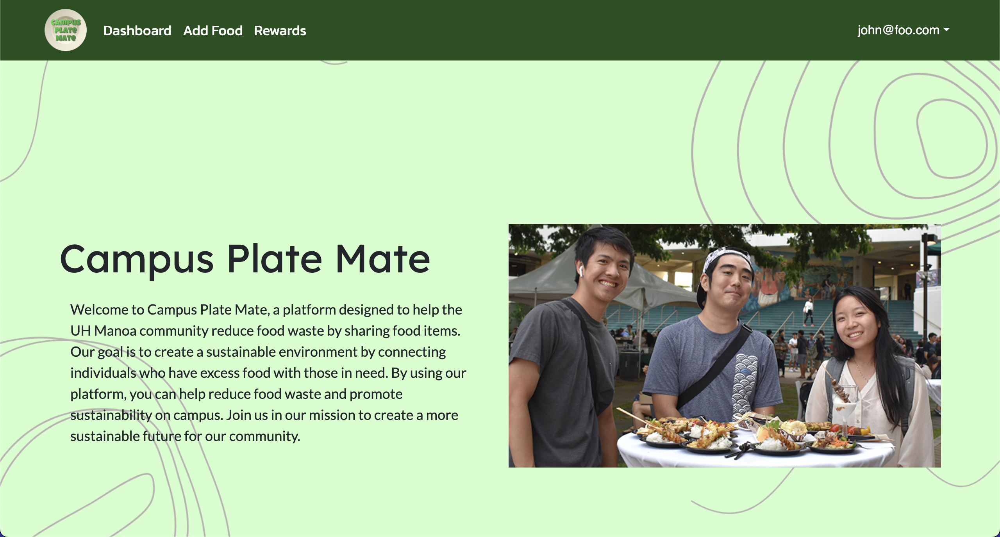
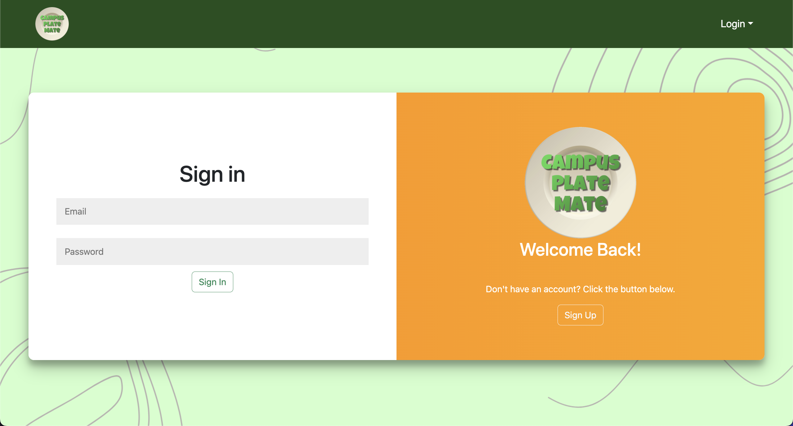
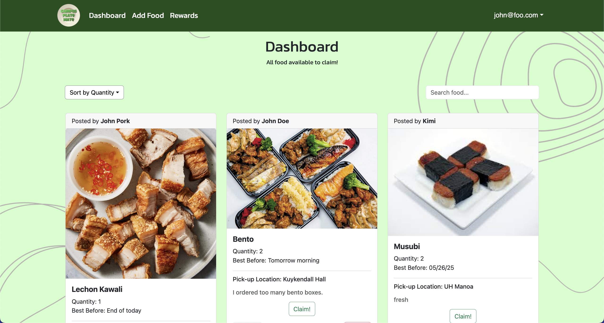
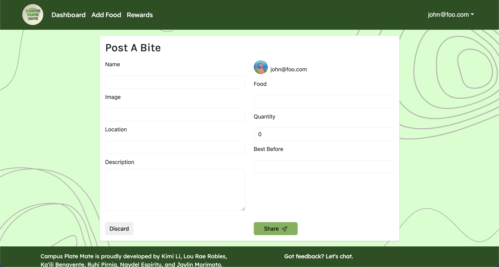
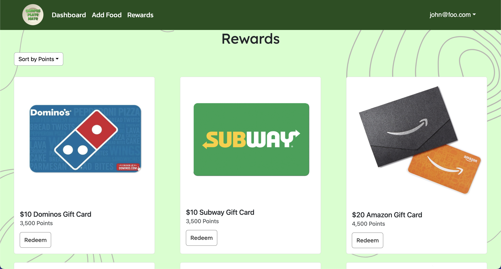
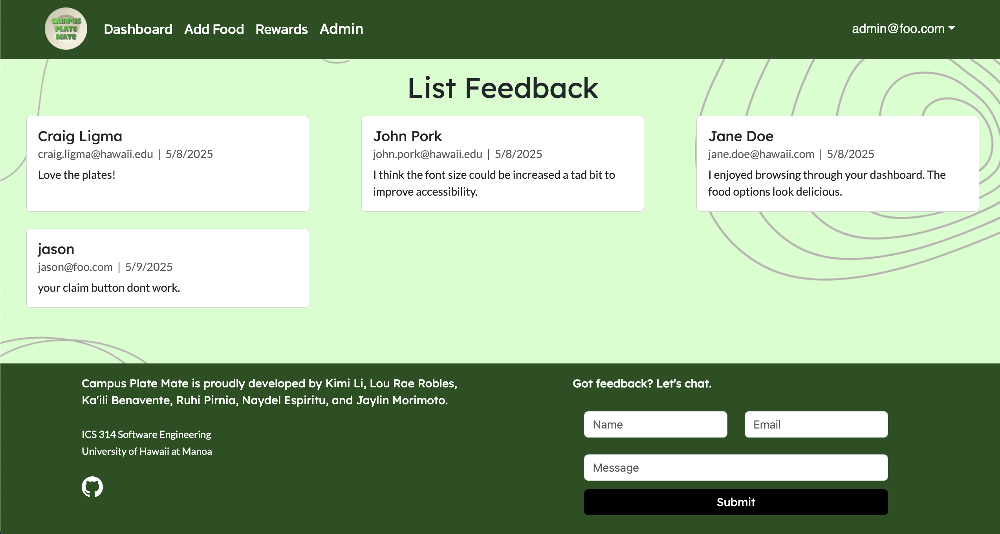

## Campus Plate Mate: Overview
  

Millions of tons of food is wasted every year in the US. Food waste contributes to greenhouse gas emissions and perfectly consumable food is going to landfills instead of those facing food insecurity. To combat food waste, our team came up with the idea of a web application that allows users to share leftover or uneaten food with others on campus. Users can post pictures of their food along with necessary pick-up information on the dashboard for others to claim. As an incentive, users who post and claim food can earn points towards potential rewards. Our website also has a feedback portion for users to give feedback on the website for admin to view. We developed our application with Typescript and CSS, using Next.js and React frameworks.

View our deployed web app here: [Campus Plate Mate](https://plate-mate-bice.vercel.app/)

For more information about Campus Plate Mate: [campusplatemate.github.io](https://campusplatemate.github.io/)

## My Contribution

For this project, I chose to focus on the back-end functionality of our website. Besides updating the user interface, the functionality I contributed to for the majority of the project timeline include the following:

- Creating the Post Data Model
- “Post A Bite” page
- “Edit Post” page
- Differentiating Admin/User Permissions

The first big task I was responsible for involved creating a Post model with its required fields in the schema.prisma. The model refers to a table in our database that stores all the information on the posts created by users. I created the “Post A Bite” page for users to create and share a post by entering important information such as: location, food, description, and quantity. I updated permissions so that users can edit or delete their own posts and the admin can delete any post from the dashboard that violates guidelines.

  

  

  

  

  

  

