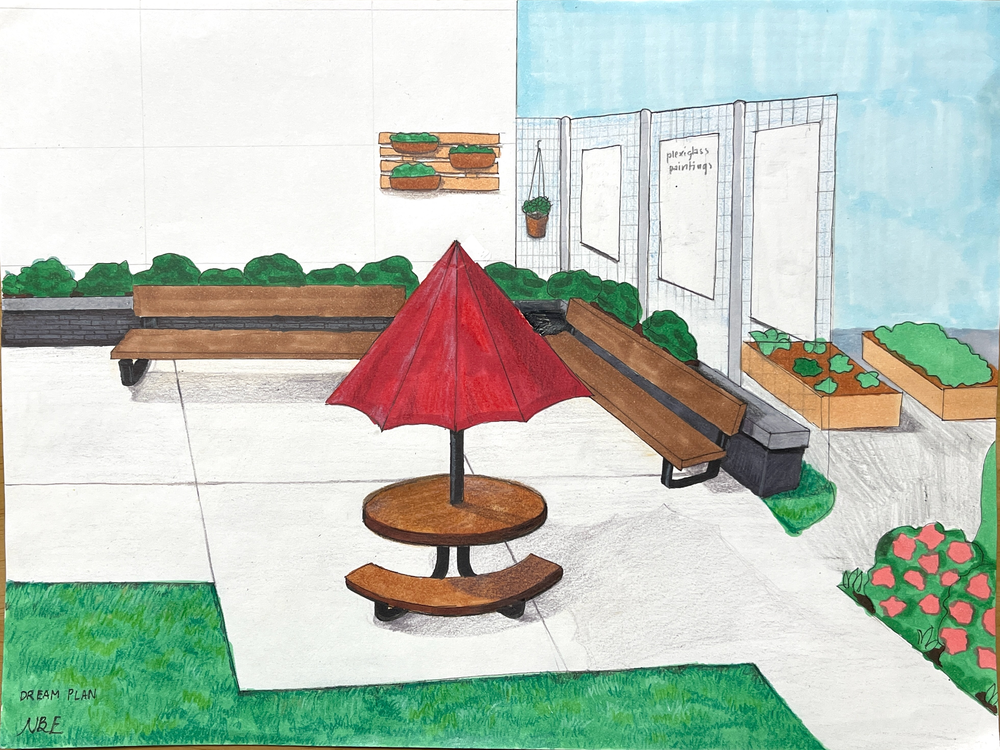
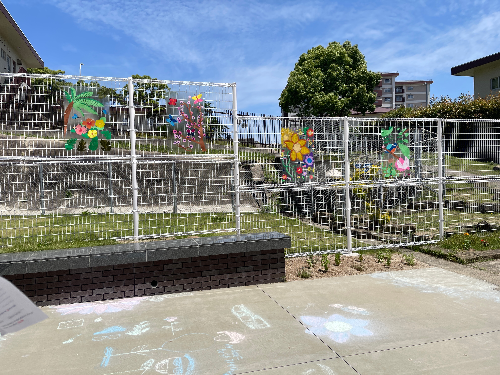

Together, we decided to paint on plexiglass, a durable material, with acrylic paint which adheres to the plexiglass well. To further beautify the area, we planted flowers and herbs such as mint along the fences.

My proposed design for the school's recreation area:

Results of the plexiglass paintings and garden.
 

